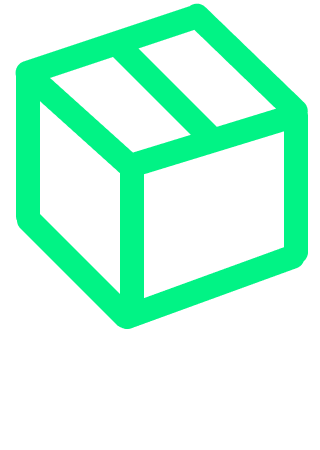

<!DOCTYPE html>
<html lang="pt-BR">
<head>
  <meta charset="UTF-8">
  <meta name="viewport" content="width=device-width, initial-scale=1.0">
  <title>Loquei</title>
  
  <!-- Adicionando a fonte Poppins via Google Fonts -->
  <link href="https://fonts.googleapis.com/css2?family=Poppins:wght@400;700&display=swap" rel="stylesheet">
</head>
<body>

  

  <h1>Quem somos?</h1>

  
Somos a Loquei e buscamos revolucionar a maneira como você acessa e compartilha itens.

  <h1>Nossa Visão</h1>

  
Imaginamos um mundo onde a posse de itens é menos importante que o acesso a eles. Acreditamos que compartilhar é a chave para um futuro mais sustentável e eficiente. Nossa plataforma conecta pessoas, promovendo o uso inteligente e colaborativo dos recursos.

  <h1>Nossa Missão</h1>

  
Na Loquei, nossa missão é transformar o conceito de propriedade. Facilitamos o compartilhamento de itens, permitindo que você encontre o que precisa, quando precisa, sem a necessidade de compra. Promovemos a sustentabilidade, economizando recursos e reduzindo o desperdício.

  <h1>Benefícios da Nossa Plataforma</h1>

  <ul>
    <li>Economia: Pague apenas pelo uso, economizando dinheiro ao evitar compras desnecessárias.</li>
    <li>Sustentabilidade: Reduza seu impacto ambiental ao reutilizar itens em vez de comprá-los novos.</li>
    <li>Conveniência: Encontre itens próximos a você, disponíveis para aluguel imediato.</li>
    <li>Confiança: Nossa plataforma garante transações seguras e avaliações honestas de usuários.</li>
    <li>Variedade: De ferramentas e equipamentos a itens de lazer e eventos, você encontra de tudo na nossa plataforma.</li>
    <li>Descubra: Navegue por uma vasta gama de itens disponíveis para aluguel.</li>
    <li>Reserve: Escolha o item que precisa e faça uma reserva de forma rápida e fácil.</li>
    <li>Use: Pegue o item com o locador e use pelo período necessário.</li>
    <li>Devolva: Retorne o item conforme combinado e deixe sua avaliação.</li>
  </ul>

<h1>Impacto Social e Ambiental</h1>

Ao promover a economia compartilhada, estamos contribuindo para uma sociedade mais conectada e consciente. Cada aluguel feito em nossa plataforma ajuda a:

<ul>
  <li>Reduzir o Consumo Excessivo: Menos produção e compra de itens novos.</li>
  <li>Diminuir o Desperdício: Itens são utilizados mais vezes e por mais pessoas.</li>
  <li>Economizar Recursos: Menos energia e materiais são gastos na produção de novos itens.</li>
</ul>

  <h1>Autores</h1>
  <a href="https://www.github.com/kaykyfreitas">@kaykyfreitas</a>
  <a href="https://www.github.com/srTeixeiraDias">@srTeixeiraDias</a>
  <a href="https://www.github.com/paulocidrao">@paulocidrao</a>
  <a href="https://www.github.com/VitorHugoAntunes">@VitorHugoAntunes</a>

</body>
</html>
